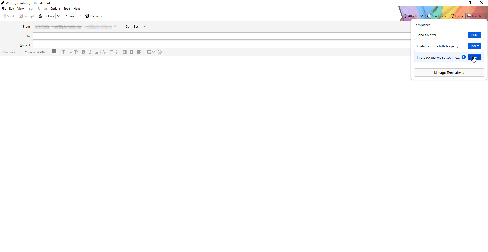
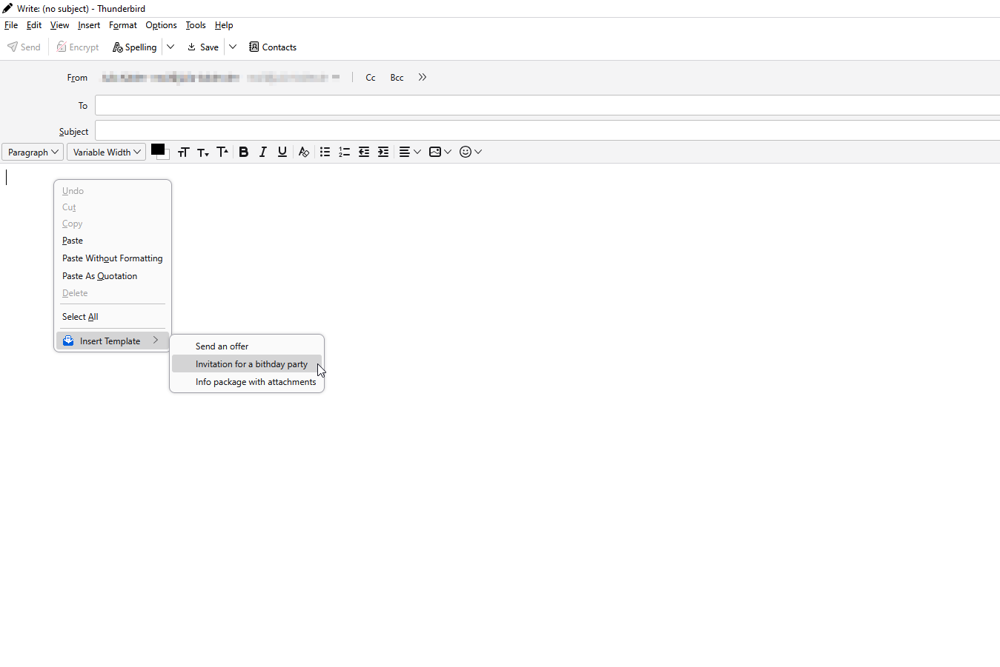
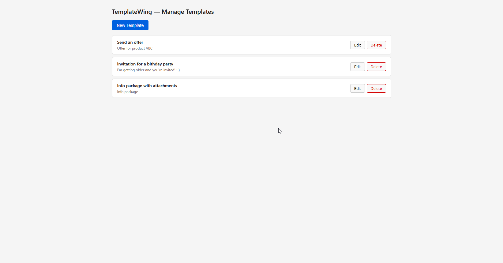
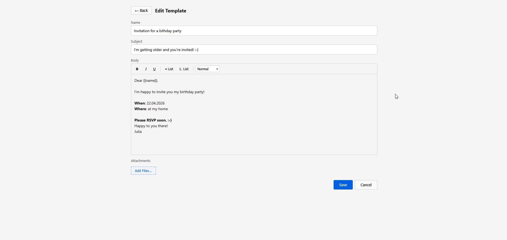

# TemplateWing

An easy-to-use template management add-on for Mozilla Thunderbird (128+).

[](https://addons.thunderbird.net/thunderbird/addon/templatewing/)

Save and reuse email templates — including file attachments — directly from the compose window.

## Screenshots

| Template selection | Context menu |
|---|---|
|  |  |

| Manage templates | Template editor |
|---|---|
|  |  |

## Features

- **Rich text editor** — Create templates with bold, italic, underline, lists, headings, and quotes
- **File attachments** — Attach files to templates; they are stored with the template and added automatically when inserting
- **One-click insert** — Insert templates via the toolbar button in the compose window or the right-click context menu
- **Subject, recipients & insertion mode** — Set a default subject, To/Cc/Bcc addresses, and choose whether the template appends to or replaces the current message body
- **Categories** — Organise templates into categories and filter by them in both the popup and the options page
- **Variables** — Use `{DATE}`, `{TIME}`, `{SENDER_NAME}`, and `{SENDER_EMAIL}` in subject or body; they are resolved on insert
- **Keyboard shortcuts** — Insert your first 9 templates with `Ctrl+Shift+1` – `Ctrl+Shift+9` directly from the compose window
- **Recent templates first** — The popup sorts by most recently used, so your go-to templates are always at the top; the options page shows a usage count per template
- **Import / Export** — Back up all templates as a JSON file and restore or share them on any device
- **Save from email** — Right-click any message in the message list → *Save as Template* to create a template pre-filled with subject and body
- **Dark mode** — Follows the system colour scheme automatically
- **Localized** — Full English and German localization

## Installation

### From Thunderbird Add-ons (ATN)

1. Visit the [TemplateWing page on Thunderbird Add-ons](https://addons.thunderbird.net/thunderbird/addon/templatewing/)
2. Click **Add to Thunderbird**

### Manual installation

1. Download the latest `.xpi` file from the [Releases](https://github.com/JuliaKalder/TemplateWing/releases) page
2. In Thunderbird: Menu (≡) → Add-ons and Themes (`Ctrl+Shift+A`)
3. Gear icon (⚙) → Install Add-on From File… → select the `.xpi` file

## Usage

1. Open a new compose window
2. Click the **TemplateWing icon** in the toolbar to see your templates
3. Click **Insert** to apply a template — or use `Ctrl+Shift+1`–`9` for the first nine
4. Click **Manage Templates…** to create, edit, or delete templates

Templates can also be inserted via the **right-click context menu** in the compose body.

To create a template from an existing email, **right-click a message** in the message list and choose **Save as Template**.

## Development

### Load as temporary add-on

1. Open Thunderbird → Menu (≡) → Add-ons and Themes (`Ctrl+Shift+A`)
2. Gear icon (⚙) → Debug Add-ons
3. **Load Temporary Add-on…** → select `manifest.json`
4. Click **Inspect** next to the add-on for console/debugging

Reload after changes by clicking **Reload** on the Debug Add-ons page (no restart needed).

### Build XPI

```powershell
powershell -ExecutionPolicy Bypass -File build-xpi.ps1
```

This creates `templatewing-<version>.xpi` in the parent directory.

Alternatively, on any OS with `zip` installed:

```bash
zip -r ../templatewing.xpi manifest.json background.html background.js \
  LICENSE modules/ popup/ options/ images/ _locales/ \
  -x ".*" -x "*.md" -x "build-xpi.ps1"
```

### Project structure

```
manifest.json              — Extension manifest (Manifest V2)
background.html            — Background page (loads background.js)
background.js              — Context menu, storage listeners
modules/template-store.js  — CRUD operations over storage.local
popup/popup.html|css|js    — Compose-action popup (template list & insert)
options/options.html|css|js — Options page (template editor)
images/                    — Extension icons (SVG source + 16/32/64/128 PNG)
_locales/en/               — English strings
_locales/de/               — German strings
```

No build step, no bundler, no external dependencies — just vanilla ES6 modules.

## Privacy

TemplateWing stores all data locally on your device using Thunderbird's built-in storage API. No data is collected, transmitted to external servers, or shared with third parties.

## License

[Mozilla Public License 2.0](LICENSE)

## Contributing

Found a bug or have an idea? [Open an issue](https://github.com/JuliaKalder/TemplateWing/issues) — constructive feedback is always welcome!
